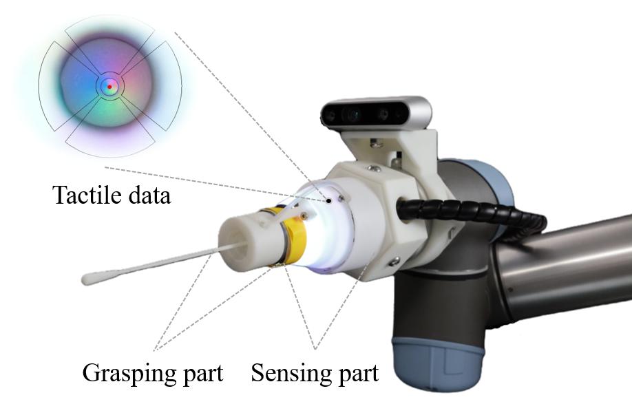
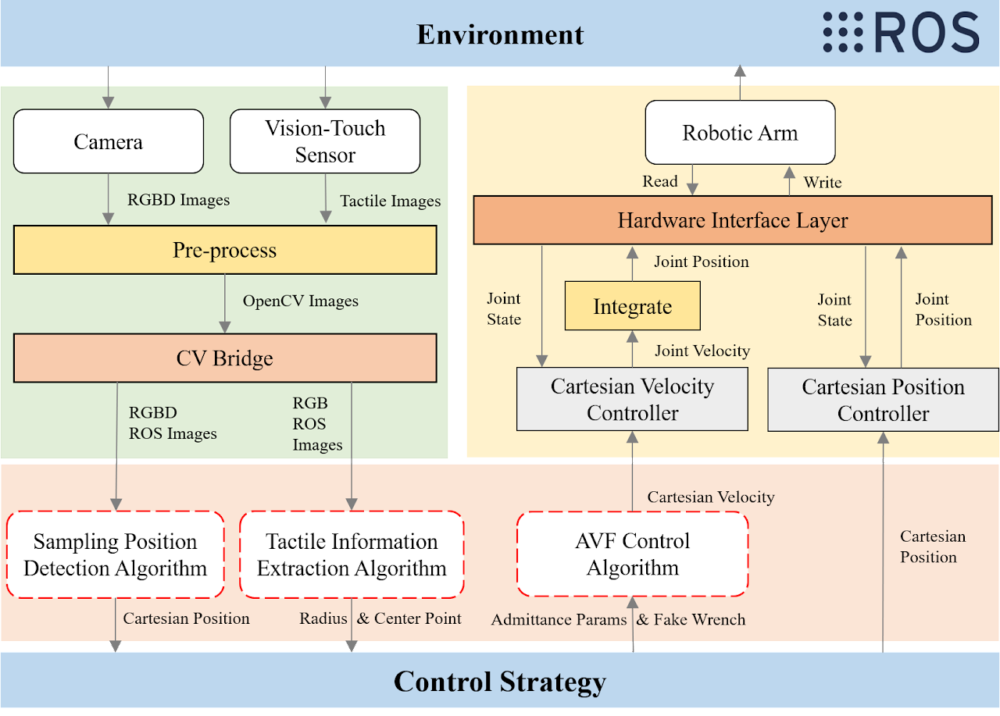

# Visuo-Tactile Sensor Enabled Pneumatic Device Towards Compliant Oropharyngeal Swab Sampling

**Author:** Shoujie Li, Mingshan He, Wenbo Ding, Linqi Ye, Xueqian Wang, Junbo Tan, Jinqiu Yuan,Xiao-Ping Zhang

  Manual oropharyngeal (OP) swab sampling is an intensive and risky task. In this article, a novel OP swab sampling device of low cost and high compliance is designed by combining the visuo-tactile sensor and the pneumatic actuator-based gripper. Here, a concave visuo-tactile sensor called CoTac is first proposed to address the problems of high cost and poor reliability of traditional multi-axis force sensors. Besides, by imitating the doctor's fingers, a soft pneumatic actuator with a rigid skeleton structure is designed, which is demonstrated to be reliable and safe via finite element modeling and experiments. Furthermore, we propose a sampling method that adopts a compliant control algorithm based on the adaptive virtual force to enhance the safety and compliance of the swab sampling process. The effectiveness of the device has been verified through sampling experiments as well as in vivo tests, indicating great application potential. The cost of the device is around 30 US dollars and the total weight of the functional part is less than 0.1 kg, allowing the device to be rapidly deployed on various robotic arms. 

## Code Structure

  We basiclly use the compliant control algorithm and complete several tasts based on the ROS platform. In this figure, it has shown the whole connections and details in this research. The camera and sensor are used to contact with the external environment and acquire the state of data. And then all of the sensor data will be used in the control strategy within the preprocess and detect algorithms. The output of the control algorithm is sent to the robotic arm through the controller in ROS. Then the robotic arm works to the environment acting as the plant.

